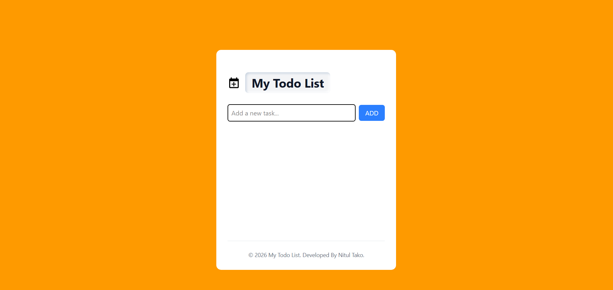

# 📝 Todo List Application

A simple and responsive Todo List Application built using **React.js** and **Tailwind CSS**.  
The application allows users to add, complete, and delete tasks while keeping the data saved in the browser using **LocalStorage**.

## 🚀 Live Demo

[View Live Demo](https://todo-app-nitul.vercel.app/)

## 📸 Preview

<!-- Add your project screenshot here -->


## ✨ Features

- ➕ Add new tasks
- ⌨️ Add tasks by pressing the **Enter** key
- ✅ Mark tasks as completed
- 🗑️ Delete tasks
- 💾 Store tasks using **LocalStorage**
- 🔔 Toast notifications using **React Toastify**
- 📱 Responsive design
- 🎨 Modern UI using **Tailwind CSS**
- 🔄 Tasks remain available after refreshing the browser

## 🛠️ Technologies Used

- **React.js**
- **JavaScript (ES6+)**
- **Tailwind CSS**
- **React Hooks**
  - `useState`
  - `useRef`
  - `useEffect`
- **React Toastify**
- **LocalStorage**
- **Vite**

## 📂 Project Structure

```text
Todo-App/
│
├── public/
│
├── src/
│   ├── assets/
│   │   ├── todo_icon.png
│   │   ├── tick.png
│   │   ├── not_tick.png
│   │   └── delete.png
│   │
│   ├── components/
│   │   ├── Todo.jsx
│   │   └── TodoItems.jsx
│   │
│   ├── App.jsx
│   ├── main.jsx
│   └── index.css
│
├── package.json
├── vite.config.js
└── README.md